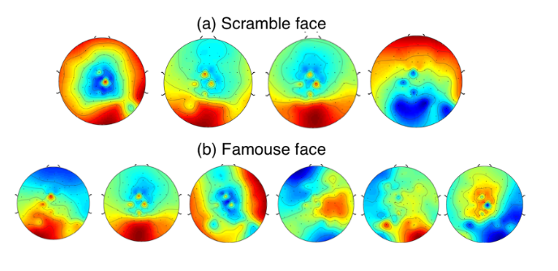
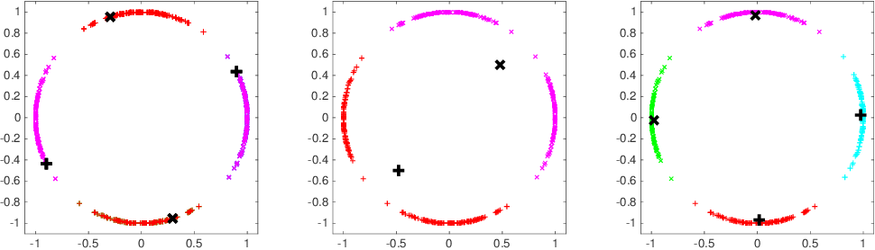

# TLDR
An expectation maximization(EM) estimator was developed for modeling EEG data with Hidden Markov Models and a Mixture of Multivariate Directional distributions (Watson and Von Mises). Check the report in [here](./assets/modeling_eeg_watson_dist.pdf)

# Modeling EEG data with EM-HMM and Directional Distributions

A current approach in neuroscience is to model the so-called [microstates](https://en.wikipedia.org/wiki/EEG_microstates). A hypothesis is that the brain's electric field remains for a short period in a defined state before moving to a new one. This project aims to identify such states and model the transitions with Hidden Markov Models(HMM).

The data used for the project is a electroencephalographs(EEG) dataset where individuals were subject to 3 different types of visual stimulations. Each subject was presented with pictures of faces of individuals they knew, they didn't know and pictures that weren't faces but resembled them.

The hypothesis that the intensity of the signals was not relevant, but their direction, was made. Thus the two relevant distributions from [directional statistics](https://en.wikipedia.org/wiki/Directional_statistics) were used: [von Mises](https://en.wikipedia.org/wiki/Von_Mises_distribution) and Watson distributions. 

The code includes the vonMises-Fisher and Watson EM-HMM estimators. For it's development the following papers were used:
- [Clustering on the Unit Hypersphere using von Mises-Fisher Distributions](https://www.jmlr.org/papers/volume6/banerjee05a/banerjee05a.pdf)
- [A short note on parameter approximation for von Mises-Fisher distributions:
and a fast implementation of Is(x)](https://link.springer.com/article/10.1007/s00180-011-0232-x)
- [Variational Inference for Watson Mixture Model](https://pubmed.ncbi.nlm.nih.gov/26571512/)
